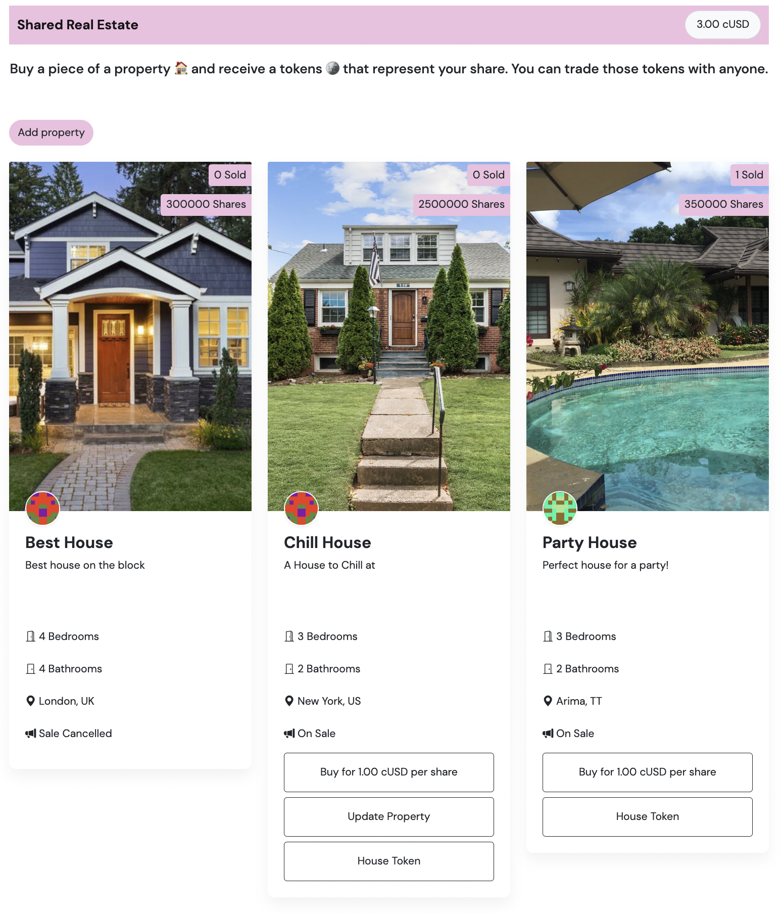
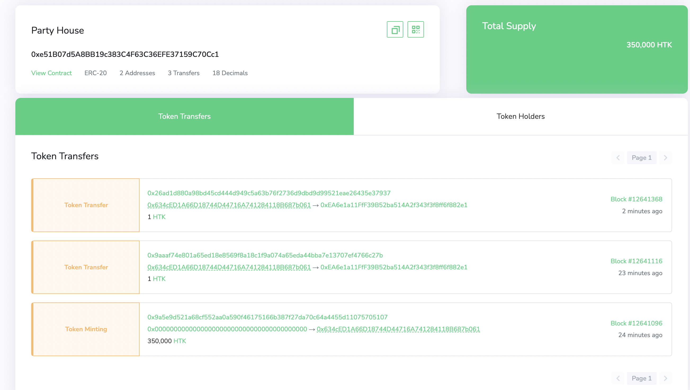

# Celo Marketplace Dapp


## Description
This is a shared real-estate marketplace dapp where users can:
- list properties for sale which creates a token for each share on sale
- property owners can update the price or cancel the sale only when no shares have been sold
- anyone can buy a share
- only owners would see the update property button so that they can update the property details.

## Smart Contract Functionality Added
- Create an ERC20 token for each property added
- Transfer those adequate number ERC20 tokens to the person who bought a share of the property
- Cancel Sale Method
- Update Sales Price Method


## Front End Functionality Added
- Update Property Modal with the option to update price or cancel sale
- Conditional display of update property button (only property owners see it)
- Added more characteristics such as number of bedrooms, bathrooms etc
- Added link to ERC20 House Token for each property 


## TODO
- only approve tokens when there is no allowance
- Allow property owner to update the number of shares on sale and thus transfer the right number of tokens 

## Live Demo
[Marketplace Dapp](https://alysiahuggins.github.io/dacade-celo-dapp-101-demo/)

## Usage

### Requirements
1. Install the Metamask wallet
2. Create a wallet.
3. Go to [https://celo.org/developers/faucet](https://celo.org/developers/faucet) and get tokens for the alfajores testnet.
4. Switch to the alfajores testnet in the Metamask.

### Test
1. Create a property.
2. Create a second account in your extension wallet and send them cUSD tokens.
3. Buy property with secondary account.
4. Check if balance of first account increased.
5. Check your wallet to see if you have the House Token
6. Create another property.
7. Update the price of a property that you own.
8. Cancel the sale of a property you own that haven't had any sales yet

### An Example of House Token and its transfers after each sale


## Project Setup

### Install
```
npm install
```

### Start
```
npm run dev
```

### Build
```
npm run build
```